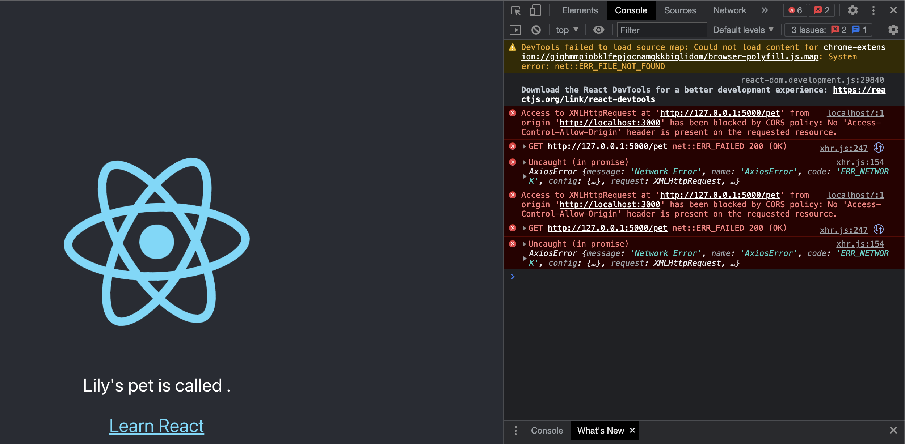

I am working on Mac OS.

My main tech stack:

What I installed | Version
---------|---------
Node.js  | 16.16.0
Python   | 3.8.9
Flask    | 2.2.2
Werkzeug | 2.2.2

## Initializing frontend and backend
### Frontend setup
> Reference to this guide: https://create-react-app.dev/docs/adding-typescript/

1. Open a new Terminal.
<!-- This will be your frontend terminal where you do frontend-related tasks. -->
1. Go into your folder/repository where you will work on this project. For me, the repository name is `fullstack-demo`, so my path should end with `/fullstack-demo`.
    > You can check your path with the `pwd` command. Use the `cd` command to navigate into your repository.
1. Create a React frontend project that is in TypeScript.

    ```bash
    npx create-react-app lily-frontend --template typescript`
    ```
    If the following question pops up, just type `y` then press "enter".
    ```
    Need to install the following packages:
    create-react-app
    Ok to proceed? (y) y
    ```
1. Go into the `lily-frontend` folder.
   ```
   cd lily-frontend
   ```
1. Start the frontend.
    ```
    npm start
    ```
1. A browser should then pop up automatically. The URL is at `localhost:3000`. There is a rotating React atom icon. This is your frontend project running in the browser!

### Backend setup
> Reference to this guide: https://flask.palletsprojects.com/en/2.2.x/quickstart/

1. Open a new Terminal.
 <!-- This will be your backend terminal where you do backend-related tasks. -->
1. Go into your folder/repository where you will work on this project. For me, the repository name is `fullstack-demo`, so my path should end with `/fullstack-demo`.
    > You can check your path with the `pwd` command. Use the `cd` command to navigate into your repository.
1. Create a folder for your backend project.
    ```bash
    mkdir lily-backend
    ```
1. Go into the backend folder.
   ```bash
   cd lily-backend
   ```
1. Prepare a python virtual environment for the backend.
    > Reference to this guide: https://flask.palletsprojects.com/en/2.2.x/installation/#virtual-environments
    1. Create a python virtual environment.
       ```bash
       python3 -m venv lily-venv
       ```
    1. Activate the environment.
       ```bash
       . lily-venv/bin/activate
       ```
    1. Observe that `(lily-venv)` will show up on your terminal, at the beginning of the line where you type commands.
       ```
       (lily-venv) lilychan@Lilys-MacBook-Pro lily-backend %
       ```
1. Install the `Flask` library.
   ```bash
   pip install Flask
   ```
1. Take a record of the current list of dependencies that is installed in the virtual environment.
    ```bash
    pip freeze > requirements.txt
    ```
1. Create a new file called `main.py`.
1. Copy and paste the following code to `main.py`:
    ```python
    from flask import Flask

    app = Flask(__name__)

    @app.route("/")
    def hello_world():
        return "<p>Hello, World!</p>"

    ```
1. Start the backend.
    ```
    flask --app main run --port 5432
    ```
    > The default port 5000 is taken by the airPlay receiver on mac, so I am using port 5432.
1. Try to open this in a browser: `127.0.0.1:5432`.
    You should see `Hello, World!`
1. Observe that in the terminal running your backend, there is at least one line that looks like this:
    ```
    127.0.0.1 - - [04/Mar/2023 21:16:35] "GET / HTTP/1.1" 200 -
    ```

## Make the frontend show some data from your backend
Now, the scenario is simple:

Show this sentence "Lily's pet is called Teddy!" on the frontend, where "Teddy" is a piece of data provided by the backend.

### Frontend
Now, let's make the frontend show this sentence:

**Lily's pet is called `xxxxx`!**

The frontend does not know the name of Lily's pet yet. Let's make the frontend ask the backend for the answer.

1. In the terminal running your frontend (should be the first terminal that you created), do `command + C` to stop the frontend.
1. Just to confirm, observe that the location of this terminal is at `lily-frontend`.
    > You can check your path with the `pwd` command. Use the `cd` command to navigate into your frontend folder.
1. Install `axios`.
   ```bash
   npm install --save axios
   ```
1. Observe that `axios` is now added to `package.json` in your frontend folder
1. Now, open the file `src/App.ts` in a text editor.
1. Create a React state called `petName`:
   > Why not just create a variable?
   >
   > Backends take time to answer. So, the moment when the frontend loads, the backend usaually has not answered yet.
   > If we store the answer in a variable, the code would not notice when the answer has arrived, hence not showing it on the frontend page.
   > 
   > React state helps us by telling the code when the answer arrives, so our frontend page knows to update the page with the answer obtained.

    1. Add this line at the top of the `App` function:
       ```ts
       const [petName, setPetName] = React.useState<string>('');
       ```
    1. Replace the following line:
        ```
        Edit <code>src/App.ts</code> and save to reload.
        ```
        with: 
        ```
        Lily's pet is called {petName}.
        ```
1. Observe the top few lines of the file. They all start with `import`.
1. At the end of this block of code, add a new line:
    ```ts
    import axios from 'axios';
    ```
1. Call the backend with `axios`.

    > Why `useEffect`?
    > 
    > When the frontend is loaded in your web browser, the `App` component can be rendered so many times due to several reasons. They are not always relevant to what you are trying to do.
    > 
    > Since the backend call is part of the `App` component, it means the frontend will call the backend as many times as the `App` component is rendered.
    > This is wasting resources. Imagine your neighbour knocking on your door several times in a roll for the same request.
    > 
    > So, we will put the backend call in a `useEffect()` block, which means our backend call should only run as many times as it requires. In our case, only once.
   1. After where the state `petName` is defined, add an empty `useEffect` block:
      ```tsx
      React.useEffect(() => {
          // ... backend call goes here
      }, [])
      ```
       Note that the `[]` tells React to only run the backend call once. More info about dependencies: https://beta.reactjs.org/reference/react/useEffect#parameters
    1. After the comment `// ... backend call goes here`, add the backend call:
        ```ts
        axios.get<string>('127.0.0.1:5432/pet')
          .then(response => setPetName(response.data));
        ```
       Note that I expect the `data` of the backend response to be `Teddy`, so I use `setPetName` to set that as the `petName`.
    1. Check that the block of code should look like this:
        ```ts
        useEffect(() => {
            // ... backend call goes here
            axios.get<string>('http://127.0.0.1:5432/pet')
                .then(response => setPetName(response.data));
        }, [])
        ```
    > Now, the `axios` library will try to get an answer from your backend at `http://127.0.0.1:5432/pet`. We haven't added the path `/pet` in the backend yet so the answer here will be empty.
1. Start the frontend again by running `npm start` in the terminal.

### Let your backend provide the name
I want to show on my frontend that my dog's name is Teddy.
So, let me make my backend answer this question -- the pet name is Teddy.

1. Now, add a route to the backend. Paste the following to the end of the file `main.py`.
    ```python
    @app.route("/pet")
    def get_pet():
        return "Teddy"
    ```
    Such that when someone goes to `127.0.0.1:5432/pet`, they will see the answer "Teddy".
1. Open the terminal that is running your backend.
1. Do `command + C` to stop the backend, since it is outdated now.
1. Run `flask --app main run --port 5432` again, such that your backend is now running with the latest changes.
1. Go to `127.0.0.1:5432/pet` in a web browser. You should see `Teddy`.

Now, the frontend should be ready! Right?

### Understanding CORS
Unfortunately, if you skip this section, our frontend would not show a complete sentence `"Lily's pet is called Teddy."`. Instead, it will look like `"Lily's pet is called ."`

#### Why?

If you open the console on your browser (right click > `Inspect` > Find the `Console` tab), you will see the error: It is something about CORS.


What it means is that your browser only wants you, the person, to ask questions.
But right now, it is your frontend that is trying to ask the backend a question -- "Qhat is the pet name?"

Your browser does not know if your frontend is a good or evil website.
Your backend also didn't specify that this frontend can be trusted too.
It is meaningless for the frontend to say that "Hey I'm a good website". Because this is what the bad guys usually say.

So, your browser does not let your frontend ask the question -- "What is the pet name?", and throwed this CORS error.

#### Solution
There are many solutions and options, from API Proxy to API Gateway. You can Google and learn more about them, but for now, let's just put in the backend to say that we can trust the frontend.

> References: https://flask-cors.readthedocs.io/en/latest/#simple-usage, https://flask-cors.corydolphin.com/en/latest/api.html#extension

1. Go to the backend folder. `lily-backend`
1. Install the python library `flask-cors`.
    ```bash
    pip install flask-cors
    ```
1. Update `requirements.txt`
    ```bash
    pip freeze > requirements.txt
    ```
1. In the top of the file `main.py`, add:
   ```python
   from flask_cors import CORS
   ```
1. After the line where `app` is defined (i.e.: `app = Flask(__name__)`), add this:
   ```python
   CORS(app, origins=["http://localhost:3000"])
    ```
    > observe that the path `http://localhost:3000` is where your frontend is running at.
1. Now in the web browser, open the frontend (`localhost:3000`) and reload.
1. YOU SHOULD SEE IT NOW! RIGHT???
1. Observe that the backend terminal contains a few lines like the following:
   ```
   127.0.0.1 - - [04/Mar/2023 21:23:22] "GET /pet HTTP/1.1" 200 -
   ```
   They are the calls made by your frontend.
   Your frontend is now showing data coming from your backend!
   > Why are there 2 calls being made when I only load the frontend once?
   > This is because when React runs in Strict mode, it renders twice. For more details: https://stackoverflow.com/questions/48846289/why-is-my-react-component-is-rendering-twice